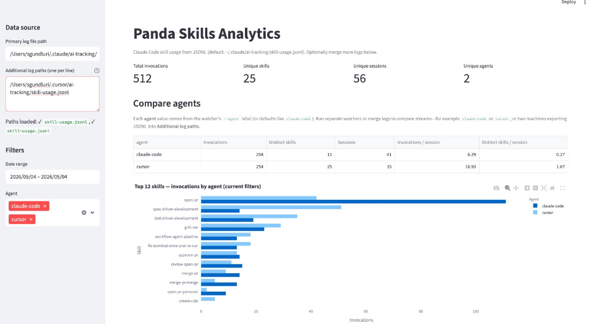
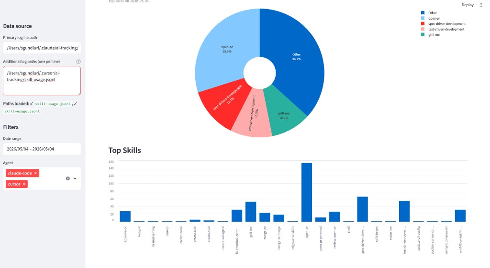
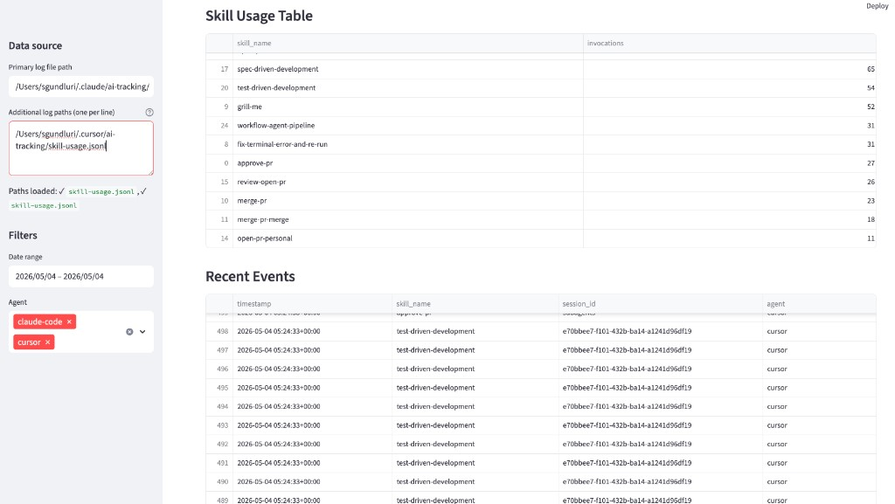

# Panda Skills for LLMs

This repo holds **skills**—small, reusable prompt workflows you can drop into Cursor, Claude Code, or similar tools. Each skill lives in its own folder with a `SKILL.md` you can read, copy, or adapt.

Inside you will also find optional **rules**, **templates**, a tiny **Streamlit dashboard** for usage charts, and **scripts** that watch your agent transcripts and log which skills showed up.

---

## Using the skills

Browse `skills/`, pick a folder, and open `SKILL.md`. That file is the contract: what the skill is for, when to use it, and how the agent should behave.

---

## Following skill usage over time

If you are curious how often certain skills actually get used, this repo includes a watcher that reads **session transcripts from disk** (it does not plug into an API). Whenever it sees a reference to a skill that exists in this repo’s `skills/` tree, it appends one line to a **JSONL** log you can chart later. A small **state** file remembers how far it has read each transcript so the same line is not counted twice.

**Layout** tells the watcher *which product’s transcript layout* to expect and where the default log files go. **`claude-code`** is the default; **`cursor`** is a separate mode for Cursor’s `agent-transcripts` files under your `~/.cursor` tree.

**Agent** is just a *label you choose* for that watcher’s events—handy when you merge logs or run more than one machine. It is not the name of the LLM inside a chat. You can run two Claude-side watchers with different `--agent` values if you want them to show up separately in the dashboard.

If you use a non-default Claude config directory, set **`CLAUDE_CONFIG_DIR`**; the watcher follows that instead of `~/.claude`.

### Claude Code

Transcripts normally live under `~/.claude/projects/` (or under `projects/` inside `CLAUDE_CONFIG_DIR` when set). By default, events go to `~/.claude/ai-tracking/skill-usage.jsonl`, with offsets in `skill-tracker-state.json` next to it.

From a clone of this repo:

```bash
pip install -r dashboard/requirements.txt

python scripts/auto_track_skill_usage.py --layout claude-code --interval-seconds 5
```

The interval watcher **does not scan old transcript bytes** for files it has never seen: it starts at the **current end of each file** and only logs skill usage from new lines written while it runs. To ingest **existing** transcript history on purpose, run **`--once`** (reads from the beginning for transcripts that are not in the state file yet). If you already ran the interval watcher (so state points at EOF) and later want a full history pass, use **`--once --backfill`** (may append duplicate rows if those sessions were already logged). Leave the interval process running while you work; stop with Ctrl+C. You can pass **`--agent some-label`** if you want a custom tag; otherwise the default label is `claude-code`.

### Cursor

Cursor needs a **second** watcher with **`--layout cursor`**. It reads transcript files under `~/.cursor/projects/…/agent-transcripts/` and writes its own JSONL under `~/.cursor/ai-tracking/` by default. Give it its own **`--agent`** (people often use `cursor`) so lines do not get mixed up with Claude Code in the dashboard.

```bash
python scripts/auto_track_skill_usage.py --layout cursor --agent cursor --interval-seconds 5
```

Same **tail-by-default** behavior as above; add **`--once`** (and optionally **`--once --backfill`**) when you explicitly want older Cursor transcripts counted.

Do not run two processes that write the **same** JSONL file.

### Opening the dashboard

```bash
streamlit run dashboard/app.py
```

The sidebar **Primary log files** multiselect defaults to **both** the Claude Code and Cursor JSONL paths under your home directory; uncheck either stream if you want only one. **Additional log paths** still accepts extra files (one per line). Your choices are stored in the **page URL** (`logs` and `extra` query parameters) so a normal browser refresh keeps the same paths.

#### Compare agents (skill invocations)

When the filtered data contains **more than one** distinct `agent` value (for example `claude-code` and `cursor` from two watchers, or two custom `--agent` labels), the dashboard shows:

1. **Per-agent summary table** — total skill invocations, count of distinct skills, session count, invocations per session, and distinct skills per session.
2. **Grouped bar chart** — for the **top 12 skills** by overall volume, horizontal bars compare **how many times each agent invoked each skill** under the current date and agent filters (Plotly legend = agent).

If you only have one agent label in the log, the chart is replaced by a short note explaining how to add a second label (another watcher, different `--agent`, or a merged JSONL).

### Letting macOS start the watchers for you

If you would rather not think about terminals, you can register two small LaunchAgent jobs—one per layout:

```bash
python scripts/install_launch_agent.py
python scripts/install_launch_agent.py --layout cursor
```

They install as `com.panda.skills.claude-code` and `com.panda.skills.cursor`. To remove them later:

```bash
python scripts/uninstall_launch_agent.py
python scripts/uninstall_launch_agent.py --label com.panda.skills.cursor
```

An older plist may still exist as `com.panda.skills.tracker`; the uninstall script can remove it if you pass that label.

One practical detail: the plist pins the **Python interpreter you used when you ran the installer**. If that ends up being the wrong one long-term, rerun the installer with the Python you actually want.

### Optional rules: “Want me to start tracking?”

Some people like the agent to **offer** to start the watcher at the beginning of a session. Copy `rules/claude-code/skill-tracking-session-offer.md` into `~/.claude/rules/`, and if you use Cursor’s agent with the same flow, copy `rules/skill-tracking-session-offer.mdc` into `~/.cursor/rules/`.

The rules check whether **that product’s** watcher is running (`pgrep` matches **`--layout cursor`** vs **`--layout claude-code`** in the process argv, not the script name alone). That way a Cursor session does not mistake a Claude-only watcher for “already covered,” and vice versa. If the matching watcher is running, they stay quiet. If not, they can ask to start it. If your skill log file is **missing or empty**, they can also ask whether to run a one-time **`--once`** pass so older transcripts are not skipped. Re-run **`install_launch_agent.py`** for each layout if an older plist omitted **`--layout claude-code`** on the Claude job—new plists always pass **`--layout`** explicitly.

Set **`PANDA_SKILLS_ROOT`** to the absolute path of this repo when you want those instructions to find `scripts/` even if the shell is not sitting in the clone. If LaunchAgents are already keeping the watcher alive, you will rarely see the prompt—that is expected.

### Quick test line

To append a single fake event for debugging:

```bash
python scripts/log_skill_event.py --skill-name brainstorming
```

For the Cursor log specifically, add `--log-path` pointing at that layout’s JSONL and an `--agent` that matches your watcher.

---

## When something looks off

**Nothing shows in the dashboard.** Confirm the JSONL path in the sidebar, remember the watcher only sees lines that mention real skill names from this repo’s `skills/` folders, and remember the interval watcher ignores transcript history until you run **`--once`** (or **`--once --backfill`** if state already tails those files).

**The file stops growing.** The interval process has to stay running, and new content has to land in the transcript paths the watcher is scanning (override with `--transcripts-root` only if you know you need it).

**You want a clean slate.** Delete `skill-usage.jsonl` and `skill-tracker-state.json` for that layout, then run `--once` again.

**The agent said it started tracking but nothing is running.** Point `PANDA_SKILLS_ROOT` at this repo or run commands from inside the clone. If the rule used `nohup`, look for `watcher-nohup.log` beside the JSONL.

**Launchd looks unhappy.** Stdout and stderr for the background jobs go to `skill-tracker-launchd.out.log` and `skill-tracker-launchd.err.log` in the same `ai-tracking/` folder as that layout’s JSONL.

Official note on where Claude Code stores data: [Claude Code application data](https://code.claude.com/docs/en/claude-directory.md#application-data).

### Screenshots

With Claude and Cursor logs merged in the sidebar (**Primary** + **Additional log paths**) and both agents selected in **Filters**, the dashboard shows per-agent totals, skill-by-agent bars, then the usual “today” slice, top skills, tables, and recent rows.

**Metrics, Compare agents, and top skills by agent**



**Today’s mix and overall top skills**



**Skill usage table and recent events**



---

## Contributing

Pull requests are welcome. A short description of what changed and why, plus how you tested it, is enough.

## License

MIT — see `LICENSE`.
